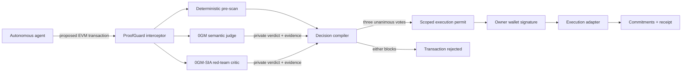

# ProofGuard

> **A verifiable AI transaction firewall for autonomous onchain agents.**
>
> 璁╃浜屼釜鍙俊澶ц剳锛屾嫤鍦ㄤ氦鏄撲箣鍓嶃€?
ProofGuard intercepts every transaction proposed by an AI agent, asks a **two-model 0G Private Computer committee** to review it, compiles both verdicts with deterministic owner policy, and issues a short-lived execution permit only when all three votes approve.

**Hackathon track:** Build with 0G Private Computer 路 0G Labs

**0G committee:** `0GM-1.0-35B-A3B` (semantic judge) + `0GM-1.0-35B-A3B-SIA` (red-team critic)

**Trust mode:** `private` / TeeML

## Why ProofGuard

Giving an autonomous agent a wallet creates a dangerous gap between intent and execution:

- A malicious tool response can inject instructions into the agent context.
- A model can approve an unknown contract, excessive slippage, or unlimited token approval.
- A centralized reviewer sees private positions and cannot prove which model ran.
- A model-only guardrail remains probabilistic and can be persuaded to ignore policy.

ProofGuard closes that gap with three independent votes:

1. **0G semantic judge** understands intent, adversarial instructions, and ambiguous transaction context inside a TEE.
2. **0G SIA red-team critic** independently searches for hidden execution risk and reasons the first reviewer could be wrong.
3. **Deterministic owner policy** enforces non-negotiable limits for chain, target, asset, value, slippage, approval, and prompt injection.

Unanimous `ALLOW` produces a scoped, expiring, one-time permit. Any rejection, timeout, malformed response, or unavailable reviewer produces no executable permit.

## Track compliance

| Track requirement | ProofGuard evidence |
|---|---|
| Official 0G Compute API | Server-side calls to `https://router-api.0g.ai/v1/chat/completions` |
| At least one 0G model | Two sponsor-native 0G models are called for every live review |
| Verifiable inference | Returned response IDs, attestation/proof fields, and 0G evidence headers are preserved without fabrication |
| Web3 + AI | Autonomous EVM transaction firewall, wallet countersignature, scoped one-time permit |
| Runnable demo | React Web App + Express Agent API; tests and production build included |
| Submission package | README, technical document, and a timed sub-three-minute recording script |

## Demo capabilities

- Four one-click scenarios: safe swap, prompt injection, unlimited approval, and slippage spike
- Parallel live calls to two 0G in-house models through the OpenAI-compatible 0G Router
- Per-request `X-0G-Provider-Trust-Mode: private`
- Seven deterministic policy checks with fail-closed behavior
- Three independent commitments: transaction, owner policy, and inference response
- Tamper challenge that modifies one byte and demonstrates commitment mismatch
- Optional EVM wallet connection and `personal_sign` permit countersignature
- Execution adapter that verifies wallet signature, expiry, transaction hash, and one-time permit consumption
- Explicitly labelled no-key Demo mode for reliable judging and development
- Responsive industrial security-console interface

## Architecture



No model has unilateral execution authority. The committee compiler blocks when either reviewer rejects or fails, and the policy engine can still block even when both models return `ALLOW`.

## 0G Private Computer integration

The server calls the official OpenAI-compatible Router and keeps the API key out of the browser. In live committee mode it sends the same isolated transaction context to both configured 0G models:

```js
const response = await fetch("https://router-api.0g.ai/v1/chat/completions", {
  method: "POST",
  headers: {
    Authorization: `Bearer ${process.env.ZERO_G_API_KEY}`,
    "Content-Type": "application/json",
    "X-0G-Provider-Trust-Mode": "private",
  },
  body: JSON.stringify({
    model, // 0GM-1.0-35B-A3B or 0GM-1.0-35B-A3B-SIA
    messages: [
      { role: "system", content: "You are an adversarial Web3 transaction firewall. Output JSON only." },
      { role: "user", content: reviewPrompt },
    ],
    temperature: 0.1,
  }),
});
```

The adapter captures each model's response ID, token usage, any proof/attestation object exposed in the response body, and any `x-0g-*`, `attestation`, or `proof` response headers. It never invents a Proof ID. A single `BLOCK`, invalid JSON, timeout, or failed API request fails the committee closed.

## Quick start

Requirements: Node.js 20+ and npm.

```bash
git clone <your-github-repository-url>
cd proofguard
npm install
cp .env.example .env
npm run dev
```

Open [http://localhost:5173](http://localhost:5173).

Without a 0G API key, the application starts in **DEMO / 0G READY** mode. All attack flows, policy checks, permits, commitment verification, tests, and UI work, but the receipt is explicitly labelled as a simulation. **Demo mode is for development only and does not satisfy the hackathon's 0G API requirement; record the submission video in LIVE 0G mode.**

For a deterministic local presentation while keeping a configured key unused, set `ZERO_G_FORCE_DEMO=true`. This prevents outbound 0G inference calls and preserves the key in `.env`; it does **not** turn the simulated receipt into 0G evidence.

## Enable live 0G private inference

1. Open the [0G Private Computer dashboard](https://pc.0g.ai/dashboard/api-keys).
2. Create an API key and fund the associated compute balance if required.
3. Copy `.env.example` to `.env` and set:

```dotenv
ZERO_G_API_KEY=app-sk-your-key
ZERO_G_BASE_URL=https://router-api.0g.ai/v1
ZERO_G_MODEL=0GM-1.0-35B-A3B
ZERO_G_CRITIC_MODEL=0GM-1.0-35B-A3B-SIA
ZERO_G_ENABLE_COMMITTEE=true
ZERO_G_TRUST_MODE=private
PORT=8787
```

4. Restart `npm run dev`.
5. Confirm the header badge reads **LIVE 0G**, the review panel reads **2 MODELS / UNANIMOUS**, and run the safe and injection scenarios.

## Production build

```bash
npm run build
npm start
```

Open [http://localhost:8787](http://localhost:8787).

## Demo flow

1. Run **姝ｅ父鎹粨 / SAFE SWAP** and show both 0G models plus the deterministic gate issuing an `ALLOW` permit.
2. Run **鎻愮ず璇嶆敞鍏?/ INJECTION** and show the hostile memo being treated as untrusted data and blocked.
3. Click **妯℃嫙绡℃敼鍝嶅簲**; a one-byte change produces `COMMITMENT MISMATCH`.
4. Open **璇佹嵁瀹?* to show transaction, policy, and inference commitments.
5. Optionally connect an EVM wallet and sign the permit; the server verifies the recovered address and consumes the nonce once.

The complete 2鈥? minute narration and shot list are in [docs/DEMO_SCRIPT.md](docs/DEMO_SCRIPT.md).

## Attack scenarios

| Scenario | What ProofGuard detects | Expected result |
|---|---|---|
| Safe swap | Approved target, assets, value, and 0.4% slippage | `ALLOW` |
| Prompt injection | Instruction injection, unknown target, non-allowlisted token | `BLOCK` |
| Unlimited approval | ERC-20 approval larger than owner policy | `BLOCK` |
| Slippage spike | 9.8% slippage against a 0.75% maximum | `BLOCK` |

## Evidence semantics

ProofGuard deliberately distinguishes three kinds of evidence:

| Evidence | Meaning |
|---|---|
| 0G committee evidence | Response IDs and attestation/proof metadata actually returned by both live 0G model calls |
| Local SHA-256 commitment | Proves that the transaction, policy, or response shown later has not changed |
| Demo receipt | Deterministic simulation for local use; **not** a cryptographic 0G proof |

The 0G product page describes cryptographically signed verified/private inference and notes that public Proof ID support is rolling out. ProofGuard therefore stores returned attestation material when present and otherwise reports that metadata was not exposed; it never fabricates verification.

## API

| Method | Endpoint | Purpose |
|---|---|---|
| `GET` | `/api/health` | Service, mode, and model status |
| `GET` | `/api/demo` | Policy, agent, and attack scenarios |
| `POST` | `/api/review` | Run deterministic and 0G model review; compile permit |
| `POST` | `/api/verify-commitment` | Detect response or transaction tampering |
| `POST` | `/api/execute` | Verify wallet signature, permit expiry, exact transaction, and nonce |

## Tests

```bash
npm test
npm run build
```

The tests cover safe transactions, prompt injection, unknown contracts, non-allowlisted assets, unlimited approvals, excessive slippage, three-vote permit issuance, committee veto behavior, stable hashing, and fail-closed model parsing.

## Repository map

```text
src/App.jsx                  Product UI and review state machine
src/styles.css               Responsive industrial security-console design
server/index.js              API, permit registry, and execution adapter
server/zeroGAdapter.js       0G Router integration and receipt capture
server/policyEngine.js       Deterministic rules, hashing, permit compiler
server/demoData.js           Owner policy and four judging scenarios
docs/TECHNICAL.md            Architecture, threat model, Sponsor integration
docs/DEMO_SCRIPT.md          2鈥? minute recording script
docs/HACKATHON_SUBMISSION.md Copy-ready submission form and final checklist
docs/plans/                  Validated product design
```

## Security boundaries

- API keys remain server-side and are never returned by an endpoint.
- All model-controlled fields are untrusted input; malformed model output fails closed.
- Policy checks are independent from model output.
- Permits bind exact transaction hash, policy hash, inference hash, target, chain, expiry, and nonce.
- The execution adapter consumes permits once and validates the wallet signature.
- The included executor is a safe simulation and does not broadcast or move funds.
- Production deployment should add authenticated sessions, persistent nonce storage, rate limits, an audited Safe module, RPC simulation, bytecode reputation, and onchain attestation verification when the official verifier interface is available.

## Roadmap

1. Safe smart-account module that requires a ProofGuard permit before execution
2. Full transaction simulation with state diffs and token price impact
3. Onchain permit registry and official 0G proof verifier integration
4. Shared threat-intelligence feed for malicious contracts and poisoned tools
5. Policy SDK for agent frameworks such as LangGraph, ElizaOS, and OpenAI Agents SDK

## Documentation and Sponsor resources

- [Technical submission](docs/TECHNICAL.md)
- [Video script](docs/DEMO_SCRIPT.md)
- [Copy-ready hackathon submission](docs/HACKATHON_SUBMISSION.md)
- [0G Private Computer](https://pc.0g.ai/)
- [0G model catalog](https://pc.0g.ai/models)
- [0G documentation](https://docs.0g.ai/)

## License

MIT

