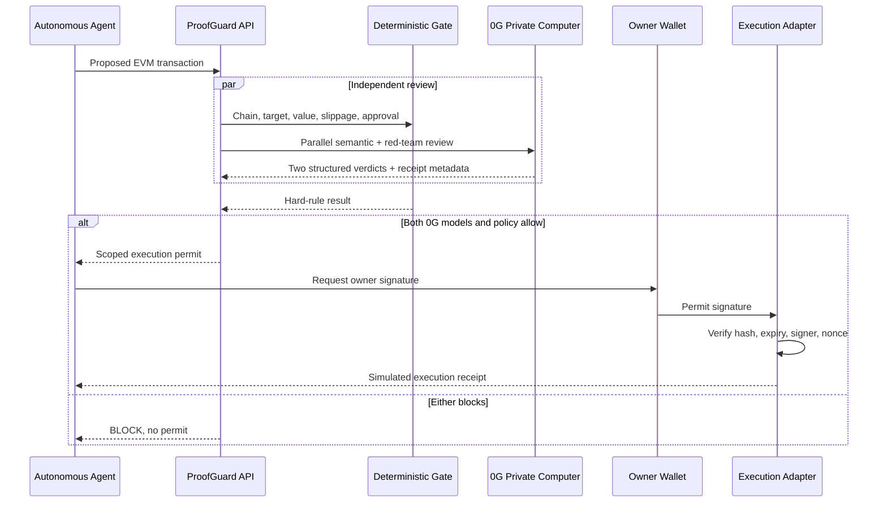

# ProofGuard 技术说明

## 1. 参赛信息

- 项目名称：ProofGuard
- 参赛赛道：赛道二 — Build with 0G Private Computer
- Sponsor：0G Labs
- 产品形态：Web App + Agent transaction firewall API
- 0G 模型委员会：`0GM-1.0-35B-A3B` 主审 + `0GM-1.0-35B-A3B-SIA` 红队复核
- 推理模式：`private` / TeeML

## 2. 项目定义

ProofGuard 是面向链上自主 Agent 的交易防火墙。Agent 产生交易后不能直接调用钱包，而是先把交易意图、calldata 摘要和 Owner Policy 交给 ProofGuard。系统通过两个 0G Private Computer 自研模型分别完成语义主审与红队复核，再由确定性策略引擎检查硬边界。只有三票全部为 `ALLOW`，系统才签发短时、限域、一次性的 Execution Permit。

它解决的不是“让 AI 更会交易”，而是“如何让 AI 在拥有交易能力后仍然可控、私密、可追责”。

## 3. Sponsor 技术接入

### 3.1 0G Router

服务端调用 OpenAI 兼容端点：

```text
POST https://router-api.0g.ai/v1/chat/completions
Authorization: Bearer $ZERO_G_API_KEY
X-0G-Provider-Trust-Mode: private
```

主审模型固定为 `0GM-1.0-35B-A3B`，红队模型固定为 `0GM-1.0-35B-A3B-SIA`。两次请求并行发出，均使用低温度、严格 JSON schema 和超时限制；任一请求失败或返回非 JSON 都会 fail closed。API key 不进入浏览器。

### 3.2 为什么必须使用 Private Computer

审查输入可能包含 DAO 仓位、交易规模、目标合约、策略 memo 和尚未广播的 calldata。如果发送给普通中心化 API，防火墙本身会成为 Alpha 与交易意图的泄露点。Private/TeeML 模式让输入在 TEE 中处理，同时为模型和执行环境提供可验证来源。

### 3.3 证据处理

适配器保存：

- 每个 0G 审查节点的 response ID
- 两个实际模型名称、角色与独立 verdict
- token usage 与 latency
- body 中的 `proof`、`attestation` 或 `verification`
- header 中所有 `x-0g-*`、`attestation`、`proof` 字段
- 模型原始响应的本地 SHA-256 commitment

系统不会伪造尚未由 API 返回的 Proof ID。Live 0G attestation、本地哈希承诺和 Demo receipt 在 UI 中使用不同标签。

## 4. 核心架构



### 4.1 前端

- React 19 + Vite
- 四个预置攻击场景
- Intercept → Private Inference → Policy → Seal 状态机
- 防火墙、证据室、架构三个页面
- EIP-191 `personal_sign` 钱包签名
- 篡改响应挑战与 fail-closed 可视化

### 4.2 后端

- Express 5
- 0G Router adapter
- 确定性策略引擎
- Permit compiler 与内存 nonce registry
- `ethers.verifyMessage` 钱包签名恢复
- 静态生产构建托管

### 4.3 Permit 数据结构

```json
{
  "version": "proofguard-permit/1",
  "decision": "ALLOW",
  "transactionHash": "0x...",
  "policyHash": "0x...",
  "inferenceHash": "0x...",
  "model": "0GM-1.0-35B-A3B",
  "models": ["0GM-1.0-35B-A3B", "0GM-1.0-35B-A3B-SIA"],
  "trustMode": "private",
  "issuedAt": "ISO-8601",
  "expiresAt": "ISO-8601",
  "nonce": "random-96-bit",
  "permitHash": "0x...",
  "scope": {
    "target": "0x...",
    "valueUsd": 2400,
    "method": "execute(bytes,bytes[],uint256)",
    "chainId": 8453
  }
}
```

## 5. 关键功能

### 5.1 语义风险审查

0G 主审模型判断交易是否存在上下文欺骗、模糊意图、恶意 memo、非预期资产流向和策略冲突；SIA 红队模型独立寻找隐藏风险及主审可能忽略的否决理由。交易字段被明确标记为 untrusted data，两个模型都不得执行字段内的指令。

### 5.2 确定性 Owner Policy

当前规则包括：

1. Chain ID 白名单
2. 目标合约白名单
3. 单笔美元价值上限
4. 最大滑点
5. 资产白名单
6. ERC-20 授权额度上限
7. Prompt Injection 模式检测

任何失败都会阻断 Permit；即使两个模型都输出 `ALLOW`，确定性规则仍拥有独立否决权。

### 5.3 三重 Commitment

- Transaction commitment：绑定实际将要执行的交易
- Policy commitment：证明 Owner Policy 没有在审查后被替换
- Inference commitment：证明展示与执行引用的是同一份模型响应

### 5.4 钱包与一次性 Permit

允许结果可以由 EVM 钱包签名。执行适配器恢复签名地址，检查 Permit 是否存在、是否过期、交易是否完全匹配、nonce 是否已使用。成功后立即消费 Permit，重放会被拒绝。

## 6. 威胁模型

| 威胁 | 缓解措施 |
|---|---|
| Prompt Injection | 交易字段隔离、模型对抗提示、确定性模式检测 |
| 单模型错误放行 | 第二 0G 模型独立红队复核 + 确定性策略门 |
| 模型响应篡改 | inference commitment |
| 交易替换 | transaction commitment 与执行时复核 |
| Permit 重放 | 短有效期 + 随机 nonce + 一次消费 |
| API key 泄露 | 仅服务端环境变量持有 |
| 假冒 0G proof | 收据类型严格区分，不构造 Proof ID |
| 模型不可用或格式错误 | fail closed，不生成 Permit |

## 7. 错误处理

- 0G 请求 45 秒超时，超时或非 2xx 直接失败关闭。
- 模型必须返回可解析 JSON；自然语言或缺字段响应不得变成 `ALLOW`。
- `decision` 除精确 `ALLOW` 外一律归一化为 `BLOCK`。
- risk score 与 confidence 强制限制在合法范围。
- `/api/execute` 对未知、已用、过期、篡改或签名不匹配 Permit 返回 422。

## 8. 测试与验收

自动化测试覆盖：

- 合法交易通过
- 未知合约与非白名单资产阻断
- Prompt Injection 阻断
- 无限授权阻断
- 异常滑点阻断
- 三票一致 Permit 规则与单票否决
- 对象稳定哈希
- 0G thinking tag 与 Markdown JSON 解析
- 非 JSON 模型响应失败关闭

验收命令：

```bash
npm test
npm run build
npm start
```

## 9. 当前 Demo 边界

- 无 0G API key 时使用确定性 Demo reviewer，页面明确标记为模拟，不宣称 TEE proof。
- 执行适配器会真实验证钱包签名和 Permit，但不会广播交易或移动资金。
- nonce registry 当前为内存存储，服务重启后清空。
- 美元价值由 Demo 场景提供，生产版需要可信价格预言机。

这些边界保证演示可重复，同时不对未实现能力作虚假陈述。

## 10. 后续迭代计划

### Phase 1：可部署交易守卫

- Safe Module / ERC-7579 validator
- RPC state simulation 与资产差异解析
- PostgreSQL nonce registry 与审计日志
- 登录、限流和多租户策略管理

### Phase 2：委员会增强

- 当前已实现 0GM 主审 + 0GM-SIA 红队复核
- 增加模型分歧可视化与风险升级
- 以成本、延迟、历史准确率动态路由

### Phase 3：链上可验证执行

- 官方 0G verifier 接口接入
- Permit Registry 合约
- TEE attestation 与交易哈希关联
- 跨链 Agent policy standard

### Phase 4：开发者生态

- LangGraph、ElizaOS、OpenAI Agents SDK 中间件
- REST/TypeScript SDK
- 恶意合约与污染工具情报网络
- DAO 与基金的 Policy Marketplace

